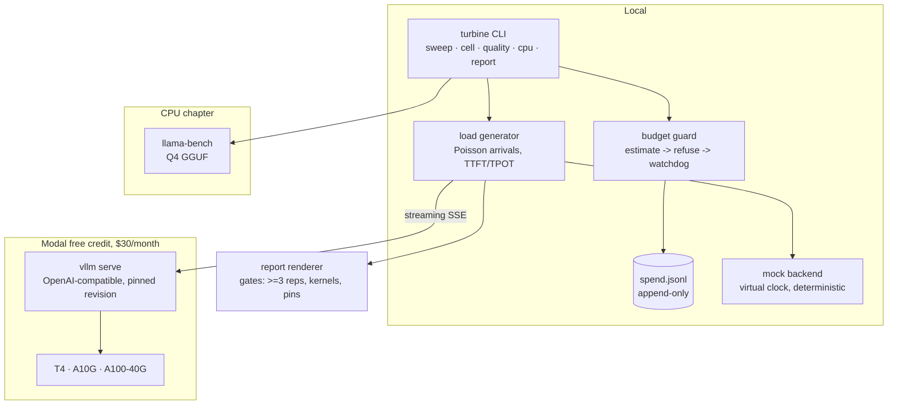

# Turbine

Inference serving benchmarks on free-tier GPU credit, and the traffic level
where self-hosting stops making sense.

Part of an eleven-project portfolio. Tollgate routes requests across
providers; Turbine is the measurement rig for the cheap end of that
routing table: open models served by vLLM on rented GPUs, priced in tokens
per second per dollar rather than tokens per second.

## Problem

Self-hosting claims are everywhere and almost none of them survive contact
with a bill. A repo benchmarks one model on one GPU, quotes a tokens-per-
second figure from a batch job, and calls it a serving number. Nobody
states the concurrency, the kernel that actually served quantized weights,
the variance across runs, or the price of the hour. And the question most
people actually have, at what traffic does renting beat paying per token,
never gets answered with numbers at all.

Turbine answers it with a fixed protocol, a credit guard that cannot
overspend, and tables where every cell carries its repetitions, its spread,
and its kernel.

## Proof

The harness is complete and exercised end to end on the deterministic mock
backend: 41 cells, three measured repetitions each, budget guard, spend
ledger, and report generation, in under two minutes on a laptop.
Regenerate it:


```bash
make bench        # synthetic grid + report at docs/MOCK-BENCH.md
```

The GPU rows are empty until they are run, and they say so rather than
carrying plausible placeholders. Measured cells land here once a Modal run
happens:

| cell | tok/s | TTFT p99 | tok/s/$ |
|---|---|---|---|
| T4 fp16 c8 rinf | not measured | not measured | not measured |
| A10G awq c8 rinf | not measured | not measured | not measured |

An honest blank is the whole point of this portfolio's method: every
number that eventually appears above is regenerated by
`uv run python -m turbine cell` against a live server, and the status
number the portfolio site displays comes from
`uv run python scripts/status.py`, which refuses mock or unpinned results.

## Architecture



**The backend is a token stream and nothing else**
([`turbine/backends/base.py`](turbine/backends/base.py)). Load generation,
scoring and reporting are written against that protocol, so the mock and a
live vLLM process exercise identical code paths. The mock runs on a virtual
clock: simulated latencies are advanced instantly and recorded exactly,
which is why synthetic results are byte-identical across machines while
still flowing through every timing statistic.

**The budget guard runs before the watchdog runs before the warmup.** A
cell is estimated against the month's remaining credit, refused if it would
land inside the safety margin, and armed with a watchdog that stops
launching new requests when its allotment runs out. Terminated GPU time is
still billed, so terminated runs still write spend entries and their
results are marked unpublishable rather than quietly averaged in.

## Method

Copied from the vLLM blog benchmark protocol so numbers stay comparable to
theirs: synthetic prompts at input length 1024 and output length 512, 300
measured requests behind 5 warmups, request rates {2, 8, inf}, TPOT and p99
TTFT reported separately. Concurrency {1, 8, 32} crosses T4/A10G with
fp16/AWQ. Every cell runs three repetitions minimum and reports mean plus
sample stdev.

Quantized rows name their kernel or do not render. This is non-negotiable
because the same AWQ weights served through different kernels differ by an
order of magnitude: roughly 10x for the Marlin path over the native one.
If an AWQ run looks slow, the first suspect is the kernel, not the card.

Prefix caching gets its own study rather than an on/off toggle: shared
prefix fraction sweeps 100% down to 0% at fixed concurrency to find where
caching stops helping, which is where reuse drops below the decode-bound
crossover.

The quality delta between precisions scores a ShipGate-format eval set
([`datasets/support-intent-quant.jsonl`](datasets/support-intent-quant.jsonl))
by exact match over repeated runs. Expect a null result: the reference
studies found 4-bit methods within a few percent on task metrics, and a
measured zero with error bars beats a claimed cliff.

The CPU chapter runs llama-bench with a Q4 GGUF. GGUF is first-class in
llama.cpp and second-class in vLLM, so the row answers a different
question: what tokens cost on hardware you already own, with no hourly
meter running.

What this does not measure: real traffic shape, multi-model serving,
speculative decoding, and anything about training. Threats to validity
including noisy-neighbour uncertainty and cloud clock variance are printed
with every report.

## Run It

Requires [uv](https://docs.astral.sh/uv/). Python 3.13.

```bash
uv sync

# full synthetic pipeline, seconds, zero credit
make bench

# tests and lint
make test
make lint

# writing-convention checks (dashes, attribution, credentials)
uv run python scripts/check_conventions.py

# what the site's status metric will say right now
uv run python scripts/status.py --json
```

A measured GPU cell needs a vLLM server somewhere and its version pins:

```bash
cp .env.example .env   # set TURBINE_BASE_URL and TURBINE_MODEL

uv run python -m turbine cell \
  --tier A10G --precision awq --concurrency 8 \
  --vllm-version 0.11.x --cuda-version 12.x --driver-version xxx.xx \
  --model-revision <hash> --gpu-host modal \
  --quantization awq_marlin

uv run python -m turbine report results/live
uv run python -m turbine spend          # month-to-date ledger
```

The guard refuses any run whose estimate lands inside the $5 safety margin
of the $30 monthly cap. Override with `TURBINE_BUDGET_CAP_USD` if your
ceiling differs.

## Technical Decisions

Full log in [DECISIONS.md](DECISIONS.md). The short version:

**Mock first, GPUs second.** Every bug in load generation, statistics and
reporting is findable in seconds on a laptop; on a billed GPU each finding
costs minutes and cents, and a broken run still writes itself into the
ledger.

**Measurements go through a socket, never in-process.** The harness talks
to `vllm serve` over OpenAI-compatible completions so it cannot influence
what it measures, and any compliant server is drop-in.

**Errors are counted, never retried inside a measured window.** A retry
replaces the quantity being measured; a failed request stays a failed
request and travels with the rep.

## Scope

Not a serving framework, not a fine-tuning rig, not a Grafana stack. It
measures, prices, guards its own budget, and renders tables whose cells
can be traced to commands. The A100-40G tier exists for one or two headline
checks, deliberately outside the default grid.
